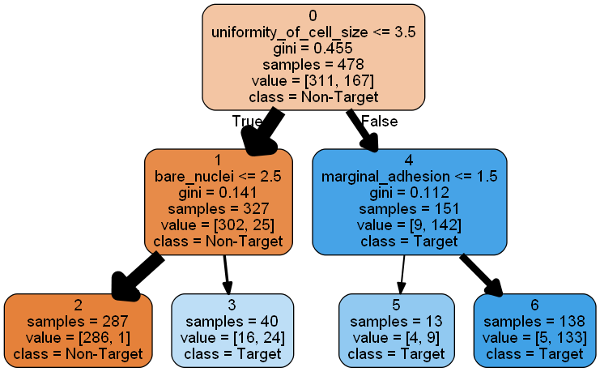
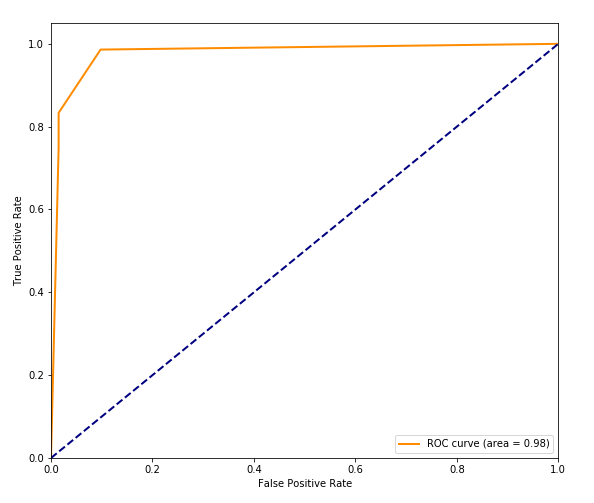
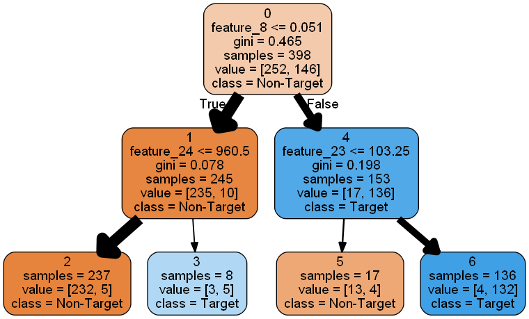
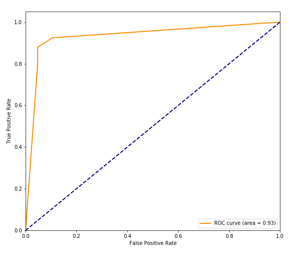
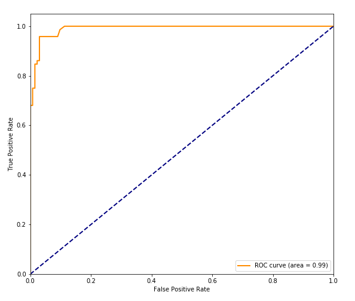
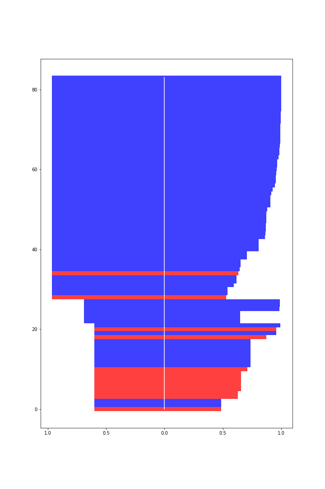
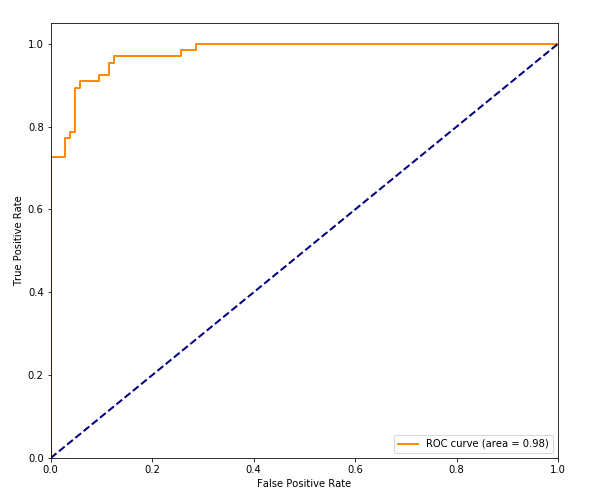
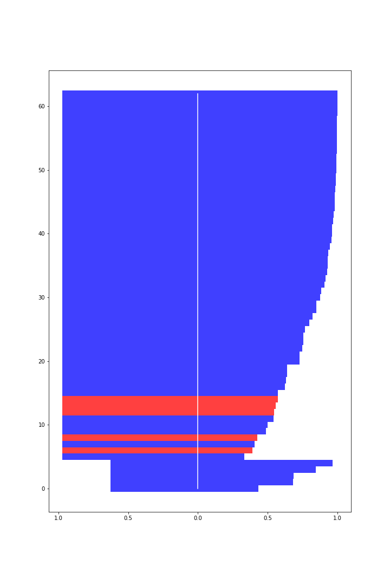

# Fuzzy Conviction Decision Tree Classifier
Contained herewith are codes used in the implementation of the paper [Fuzzy Conviction Score for Discriminating Decision-Tree-Classified Feature Vectors w.r.t. Relative Distances from Decision Boundaries](https://www.researchgate.net/publication/347974343_Fuzzy_Conviction_Score_for_Discriminating_Decision-Tree-Classified_Feature_Vectors_wrt_Relative_Distances_from_Decision_Boundaries_with_Demonstration_on_Benchmark_Breast_Cancer_Data_Sets).
> <b><i>Abstract -</i></b> We augment decision tree classification analysis with fuzzy membership functions that quantitatively qualify, at each binary decision boundary, the degree of "conviction" to which each data point (i.e. feature vector) is deemed to be on either side of said decision boundary, the further away from the decision threshold, relative to peers, the higher the fuzzy membership value (i.e. the closer to 1). Our fuzzy "conviction" score is analogous to the measure of "confidence" as per traditional statistical methods, whilst handily accommodates the nonlinear discriminant surface created by a decision tree. Although our method has been successfully deployed in confidential commercial setting, here we demonstrate the concept and computation on the benchmark "Breast Cancer Wisconsin (Original/Diagnostic)" Data Sets archived and made available publicly on the UCI (University of California, Irvine) Machine Learning Repository. In addition, we will as well demonstrate that without introducing any additional learning loops, our fuzzification of decision tree classifier improves the AUC (Area Under the ROC (Receiver Operating Characteristic) Curve) performance over that of the original decision tree classifier, provided the latter is decently capable of discriminating classes within the relevant data set to begin with.

## Usage

### Folder structure of the project

To make the project runable without path error, the structure of the folders must be similar to the listed below. 

```
.
├── datasets
│   └── dataset_link.txt
├── module
│   ├── decision_tree_util.py
│   └── model_pipline_util.py
├── results
│   ├── diagnostic
│   │   └── ......
│   └── original
│       └── ......
├── environment.yml
├── model_development_breast_cancer_wisconsin.ipynb
└── README.md
```

### Getting Started

Please follow these instructions to set the project up and run on your computer.

0. Install [Anaconda](https://www.anaconda.com/) if it hasn't installed in your machine yet.
1. After downloading the project, go to the project path and run conda env create -f environment.yml using Anaconda Prompt to create an environment.
1. Download two datasets, `breast-cancer-wisconsin.data` and `wdbc.data` from [Breast Cancer Wisconsin Data Set](https://archive.ics.uci.edu/ml/machine-learning-databases/breast-cancer-wisconsin/) and put them into `datasets`.
2. Now run all blocks in `model_development_breast_cancer_wisconsin.ipynb`
3. The results will be stored in `results` seperately with sub folders named `original` for Breast Cancer Wisconsin (Original) Data Set and `diagnostic` for Breast Cancer Wisconsin (Diagnostic) Data Set.

## Results

### Decision Tree Classifier
Here we depict trained decision tree classifiers as directed graphs, where the size of each arc/node (depicted as arrow) is proportional to the relative number of data points being partitioned by the relevant decision boundary, and each vertex/edge contains decision boundary details. The "blue" nodes correspond to positive predictions, the darker the shade "blue", the higher in-sample positive proportion, hence the higher out-sample positive probability, according to decision tree classification. The "orange" nodes correspond to negative predictions, the darker the shade "orange", the higher in-sample negative proportion, hence the higher out-sample negative probability, according to decision tree classification.
<br/><br/>
<b>Breast Cancer Wisconsin (Original) Data Set</b> Figure 1 reveals 3 decision tree leafs associated with positive (malignant) prediction, the biggest majority as well as highest positive probability of which were identified as having "uniformity_of_cell_size" > 3.5 and "marginal_adhesion" > 1.5. The discriminatory power (figure 2) is very good, without-sample/test AUC of 0.98.
<br/>

<p align="center">
	<figure class="container">
		
		<figcaption>Figure 1: Decision Tree Classifier - trained on 70% Breast Cancer Wisconsin (Original) Data Set</figcaption>
	</figure>
</p>

<p align="center">
	<figure>
		
		<figcaption>Figure 2: Decision Tree Classifier’s ROC - tested on 30% Breast Cancer Wisconsin (Original) Data Set</figcaption>
	</figure>
</p>

<b>Breast Cancer Wisconsin (Diagnostic) Data Set</b> Figure 3 reveals 2 decision tree leafs associated with positive (malignant) prediction, the greater number as well as higher positive probability of which were identified as having "feature_8" and "feature_23" greater than their respective threshold values. The discriminatory power (figure 4) is very good, with out-sample/test AUC of 0.93.

<p align="center">
	<figure class="container">
		
		<figcaption>Figure 3: Decision Tree Classifier - trained on 70% Breast Cancer Wisconsin (Diagnostic) Data Set</figcaption>
	</figure>
</p>

<p align="center">
	<figure>
		
		<figcaption>Figure 4: Decision Tree Classifier’s ROC - tested on 30% Breast Cancer Wisconsin (Diagnostic) Data Set</figcaption>
	</figure>
</p>

### Decision Tree Classifier with Fuzzy Conviction Score Overlay

<b>Breast Cancer Wisconsin (Original) Data Set</b> Figure 5 reveals that by overlaying the original decision tree classifier with fuzzy conviction score, the discriminatory power improves from AUC = 0.98 to AUC = 0.99, an improvement achieved without introducing any additional learning loops. The improvement in discriminatory power can be further examined by plotting (figure 6) both probability estimate of a standard decision tree classifier (to the left) and fuzzy conviction score (to the right) for each data point, "blue" for actual positive test cases, and "red" for actual negative test cases, where for the same value of probability estimate as per standard decision tree classifier, "blue" appear more frequently amongst higher fuzzy conviction scores, while "red" appear more frequently amongst lower fuzzy conviction scores.
<br/><br/>
<b>Breast Cancer Wisconsin (Diagnostic) Data Set</b> Figure 7 reveals that by overlaying the original decision tree classifier with fuzzy conviction score, the discriminatory power improves from AUC = 0.93 to AUC = 0.98. See also the probability estimate vs. fuzzy conviction score plot (figure 8).
<br/>

<p align="center">
	<figure class="container">
		
		<figcaption>Figure 5: Fuzzified Decision Tree Classifier’s ROC - tested on 30% Breast Cancer Wisconsin (Original) Data Set</figcaption>
	</figure>
</p>

<p align="center">
	<figure>
		
		<figcaption>Figure 6: Probability Estimate (left) vs. Fuzzy Conviction Score (right); "blue" for positive, "red" for negative cases</figcaption>
	</figure>
</p>

<p align="center">
	<figure class="container">
		
		<figcaption>Figure 7: Fuzzified Decision Tree Classifier’s ROC - tested on 30% Breast Cancer Wisconsin (Diagnostic) Data Set</figcaption>
	</figure>
</p>

<p align="center">
	<figure>
		
		<figcaption>Figure 8: Probability Estimate (left) vs. Fuzzy Conviction Score (right); "blue" for positive, "red" for negative cases</figcaption>
	</figure>
</p>

## Authors

* **Poomjai Nacaskul**
* Kongkan Kalakan - [KongkanKalakan](https://github.com/KongkanKalakan)

## References

1. Fuzzy Conviction Score for Discriminating Decision-Tree-Classified Feature Vectors w.r.t. Relative Distances from Decision Boundaries(https://www.researchgate.net/publication/347974343_Fuzzy_Conviction_Score_for_Discriminating_Decision-Tree-Classified_Feature_Vectors_wrt_Relative_Distances_from_Decision_Boundaries_with_Demonstration_on_Benchmark_Breast_Cancer_Data_Sets)
2. Breast Cancer Wisconsin (Original) Data Set (https://archive.ics.uci.edu/ml/datasets/Breast+Cancer+Wisconsin+(original))
2. Breast Cancer Wisconsin (Diagnostic) Data Set (https://archive.ics.uci.edu/ml/datasets/Breast+Cancer+Wisconsin+(Diagnostic))